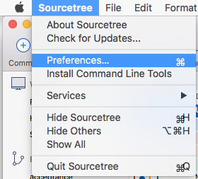
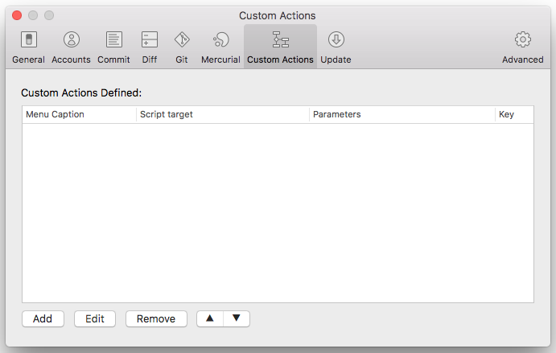
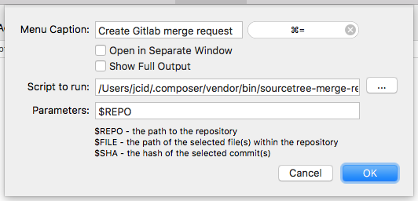

# Intro

An small tool that will open the Google Chrome browser to create an new Gitlab merge request. The Gitlab merge request is based on the current branch and current opened GIT directory inside Sourcetree.

# Installation

```bash
composer global require jcid/sourcetree-merge-request-opener
```

```bash
cd ~/.composer/vendor/jcid/sourcetree-merge-request-opener && composer dump-autoload
```

# Why?

Why was this built? Because Jira has indicated that they will not support Gitlab's own instances. For more information you can read here: 
- https://jira.atlassian.com/browse/SRCTREE-1845

# Sourcetree configuration

Open Sourcetree `preferences` (short key: `⌘ ,`)



Go to the `Custom Actions` 



Add an new `Custom Action` with the values

| Option | Value |
|---------------|--------------------------------------------------------------------|
| Menu Caption | `Create Gitlab merge request` |
| Shortcut | ⌘ = |
| Script to run | `/Users/jcid/.composer/vendor/bin/sourcetree-merge-request-opener` |
| | *Replace the `jcid` username for your own username* |
| Parameters | `$REPO` |



Now you can easily open a Gitlab merge request from the current branch with the set shortcut `⌘ =`
